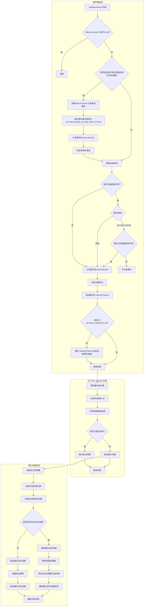
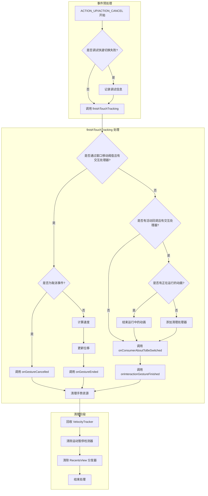
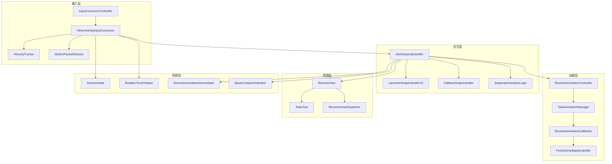
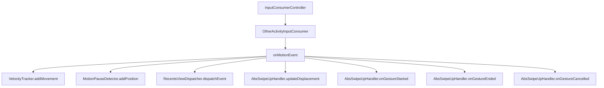
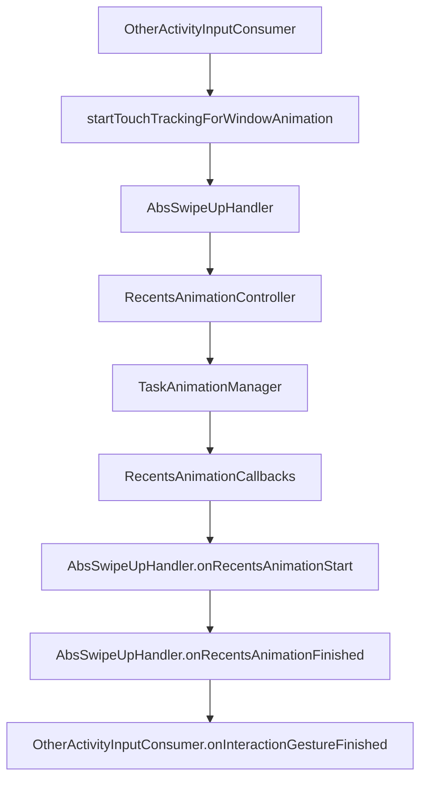
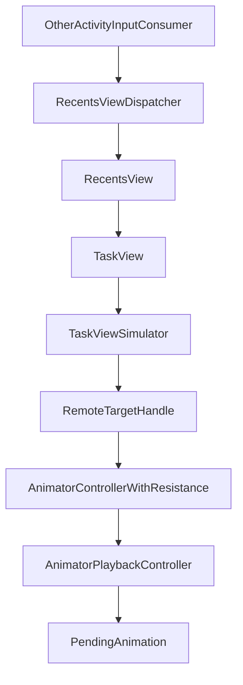

```mermaid
graph TD
    subgraph 事件预处理
        A[ACTION_MOVE 开始] --> B[查找活动指针索引]
        B --> C{指针索引是否有效?}
        C -->|否| Z[结束处理]
        C -->|是| D[记录当前触摸位置]
        D --> E[计算位移]
        E --> F{是否通过窗口移动阈值?}
    end

    subgraph 窗口移动阈值处理
        F -->|否| G{是否为延迟目标?}
        G -->|否| H{是否为触控板手势或通过触摸阈值?}
        H -->|是| I[设置通过窗口移动阈值]
        H -->|否| J[结束处理]
        I --> K[计算水平距离和向上距离]
        G -->|是| K
        F -->|是| K
    end

    subgraph 手势方向和角度计算
        K --> L[计算平方距离]
        L --> M[判断是否在扩展阈值区域]
        M --> N[判断是否通过触摸阈值]
        N --> O{是否通过触摸阈值?}
        O -->|是| P[设置通过触摸阈值标志]
        O -->|否| Q[计算手势角度]
        P --> Q
        Q --> R[判断是否在快速切换范围内]
        R --> S[设置是否可能启动新任务标志]
    end

    subgraph 手势窃取阈值处理
        S --> T{是否通过手势窃取阈值?}
        T -->|否| U{是否通过触摸阈值?}
        U -->|否| V[结束处理]
        U -->|是| W{是否为水平滑动且禁用?}
        W -->|是| X[强制取消手势]
        W -->|否| Y{是否为三指触控板手势?}
        Y -->|是| X
        Y -->|否| ZZ{是否为四指触控板手势?}
        ZZ -->|是| X
        ZZ -->|否| AAA[设置通过手势窃取阈值]
        AAA --> BBB{是否为延迟目标?}
        BBB -->|是| CCC[启动窗口动画]
        BBB -->|否| DDD[跳过启动动画]
        CCC --> EEE{是否通过窗口移动阈值?}
        DDD --> EEE
        EEE -->|否| FFF[设置通过窗口移动阈值]
        EEE -->|是| GGG[通知手势开始]
        FFF --> GGG
    end

    subgraph 交互处理器更新
        T -->|是| HHH{是否有交互处理器?}
        GGG --> HHH
        HHH -->|否| III[结束处理]
        HHH -->|是| JJJ{是否通过窗口移动阈值?}
        JJJ -->|是| KKK[更新交互处理器位移]
        JJJ -->|否| LLL[结束处理]
        KKK --> MMM{是否为全屏手势导航或触控板手势?}
        MMM -->|是| NNN[计算最小滑动距离]
        NNN --> OOO[设置是否允许缓慢滑动回家]
        OOO --> PPP[设置是否允许运动暂停]
        PPP --> QQQ[添加位置到运动暂停检测器]
        QQQ --> RRR[设置是否可能启动新任务]
        RRR --> SSS[结束处理]
        MMM -->|否| SSS
    end
```

# OtherActivityInputConsumer.onMotionEvent 详细分析

## 目录

1. [ACTION_DOWN 事件详细分析](#action-down-事件详细分析)
2. [ACTION_MOVE 事件详细分析](#action-move-事件详细分析)
3. [ACTION_UP/ACTION_CANCEL 事件详细分析](#action-upaction-cancel-事件详细分析)
4. [完整调用链分析](#完整调用链分析)
5. [总结](#总结)

---

# ACTION_DOWN 事件详细分析

## 调用流程

```java
@Override
public void onMotionEvent(MotionEvent ev) {
    if (mVelocityTracker == null) {
        return;
    }

    // Proxy events to recents view
    if (mPassedWindowMoveSlop && mInteractionHandler != null
            && !mRecentsViewDispatcher.hasConsumer()) {
        mRecentsViewDispatcher.setConsumer(mInteractionHandler
                .getRecentsViewDispatcher(mNavBarPosition.getRotation()));
        int action = ev.getAction();
        ev.setAction(ACTION_MOVE_ALLOW_EASY_FLING);
        mRecentsViewDispatcher.dispatchEvent(ev);
        ev.setAction(action);
    }
    int edgeFlags = ev.getEdgeFlags();
    ev.setEdgeFlags(edgeFlags | EDGE_NAV_BAR);

    if (mGestureState.isTrackpadGesture()) {
        // Disable scrolling in RecentsView for 3-finger trackpad gesture. We don't know if a
        // trackpad motion event is 3-finger or 4-finger with the U API until ACTION_MOVE (we
        // skip ACTION_POINTER_UP events in TouchInteractionService), so in order to make sure
        // that RecentsView always get a closed sequence of motion events and yet disable
        // 3-finger scroll, we do the following (1) always dispatch ACTION_DOWN and ACTION_UP
        // trackpad multi-finger motion events. (2) only dispatch 4-finger ACTION_MOVE motion
        // events.
        switch (ev.getActionMasked()) {
            case ACTION_MOVE -> {
                if (mGestureState.isFourFingerTrackpadGesture()) {
                    mRecentsViewDispatcher.dispatchEvent(ev);
                }
            }
            default -> mRecentsViewDispatcher.dispatchEvent(ev);
        }
    } else {
        mRecentsViewDispatcher.dispatchEvent(ev);
    }
    ev.setEdgeFlags(edgeFlags);

    mVelocityTracker.addMovement(ev);
    if (ev.getActionMasked() == ACTION_POINTER_UP) {
        mVelocityTracker.clear();
        mMotionPauseDetector.clear();
    }

    switch (ev.getActionMasked()) {
        case ACTION_DOWN: {
            // Until we detect the gesture, handle events as we receive them
            mInputEventReceiver.setBatchingEnabled(false);

            TraceHelper.INSTANCE.beginSection(DOWN_EVT);
            mActivePointerId = ev.getPointerId(0);
            mDownPos.set(ev.getX(), ev.getY());
            mLastPos.set(mDownPos);

            // Start the window animation on down to give more time for launcher to draw if the
            // user didn't start the gesture over the back button
            if (DEBUG) {
                Log.d(TAG, "ACTION_DOWN: mIsDeferredDownTarget=" + mIsDeferredDownTarget);
            }
            if (!mIsDeferredDownTarget) {
                startTouchTrackingForWindowAnimation(ev.getEventTime());
            }

            TraceHelper.INSTANCE.endSection();
            break;
        }
        // ... 其他事件类型处理
    }
}
```
// quickstep/src/com/android/quickstep/inputconsumers/OtherActivityInputConsumer.java#L193-L259

## 详细流程图



---

# ACTION_MOVE 事件详细分析

## 调用流程

```java
case ACTION_MOVE: {
    int pointerIndex = ev.findPointerIndex(mActivePointerId);
    if (pointerIndex == INVALID_POINTER_ID) {
        break;
    }
    mLastPos.set(ev.getX(pointerIndex), ev.getY(pointerIndex));
    float displacement = getDisplacement(ev);
    float displacementX = mLastPos.x - mDownPos.x;
    float displacementY = mLastPos.y - mDownPos.y;

    if (!mPassedWindowMoveSlop) {
        if (!mIsDeferredDownTarget) {
            // Normal gesture, ensure we pass the drag slop before we start tracking
            // the gesture
            if (mGestureState.isTrackpadGesture() || Math.abs(displacement)
                    > mTouchSlop) {
                mPassedWindowMoveSlop = true;
                mStartDisplacement = -mTouchSlop;
            }
        }
    }

    float horizontalDist = Math.abs(displacementX);
    float upDist = -displacement;
    boolean isTrackpadGesture = mGestureState.isTrackpadGesture();
    float squaredHypot = squaredHypot(displacementX, displacementY);
    boolean isInExtendedSlopRegion = mGestureState.isInExtendedSlopRegion();
    boolean passedSlop = isTrackpadGesture
            || (squaredHypot >= mSquaredTouchSlop
            && !isInExtendedSlopRegion);
    if (DEBUG) {
        Log.d(TAG, "ACTION_MOVE: passedSlop=" + passedSlop
                + " ( " + isTrackpadGesture
                + " || (" + squaredHypot + " >= " + mSquaredTouchSlop
                + " && " + !isInExtendedSlopRegion + " ))");
    }

    if (!mPassedSlopOnThisGesture && passedSlop) {
        mPassedSlopOnThisGesture = true;
    }
    // Until passing slop, we don't know what direction we're going, so assume
    // we're quick switching to avoid translating recents away when continuing
    // the gesture (in which case mPassedPilferInputSlop starts as true).
    boolean haveNotPassedSlopOnContinuedGesture =
            !mPassedSlopOnThisGesture && mPassedPilferInputSlop;
    double degrees = Math.toDegrees(Math.atan(upDist / horizontalDist));

    // Regarding degrees >= -OVERVIEW_MIN_DEGREES - Trackpad gestures can start anywhere
    // on the screen, allowing downward swipes. We want to impose the same angle in that
    // scenario.
    boolean swipeWithinQuickSwitchRange = degrees <= OVERVIEW_MIN_DEGREES
            && (!mGestureState.isTrackpadGesture() || degrees >= -OVERVIEW_MIN_DEGREES);
    boolean isLikelyToStartNewTask =
            haveNotPassedSlopOnContinuedGesture || swipeWithinQuickSwitchRange;

    if (DEBUG) {
        Log.d(TAG, "ACTION_MOVE: mPassedPilferInputSlop=" + mPassedPilferInputSlop);
    }
    if (!mPassedPilferInputSlop) {
        if (passedSlop) {
            // Horizontal gesture is not allowed in this region
            boolean isHorizontalSwipeWhenDisabled =
                    (mDisableHorizontalSwipe && Math.abs(displacementX) > Math.abs(
                            displacementY));
            // Do not allow quick switch for trackpad 3-finger gestures
            // TODO(b/261815244): might need to impose stronger conditions for the swipe
            //  angle
            boolean noQuickSwitchForThreeFingerGesture = isLikelyToStartNewTask
                    && mGestureState.isThreeFingerTrackpadGesture();
            boolean noQuickstepForFourFingerGesture = !isLikelyToStartNewTask
                    && mGestureState.isFourFingerTrackpadGesture();
            if (isHorizontalSwipeWhenDisabled || noQuickSwitchForThreeFingerGesture
                    || noQuickstepForFourFingerGesture) {
                forceCancelGesture(ev);
                break;
            }

            mPassedPilferInputSlop = true;

            if (mIsDeferredDownTarget) {
                // Deferred gesture, start the animation and gesture tracking once
                // we pass the actual touch slop
                startTouchTrackingForWindowAnimation(ev.getEventTime());
            }
            if (!mPassedWindowMoveSlop) {
                mPassedWindowMoveSlop = true;
                mStartDisplacement = -mTouchSlop;
            }
            notifyGestureStarted(isLikelyToStartNewTask);
        }
    }

    if (mInteractionHandler != null) {
        if (mPassedWindowMoveSlop) {
            // Move
            mInteractionHandler.updateDisplacement(displacement - mStartDisplacement);
        }

        if (mDeviceState.isFullyGesturalNavMode()
                || mGestureState.isTrackpadGesture()) {
            boolean minSwipeMet = upDist >= Math.max(mMotionPauseMinDisplacement,
                    mInteractionHandler.getThresholdToAllowMotionPause());
            mInteractionHandler.setCanSlowSwipeGoHome(minSwipeMet);
            mMotionPauseDetector.setDisallowPause(!minSwipeMet
                    || isLikelyToStartNewTask);
            mMotionPauseDetector.addPosition(ev);
            mInteractionHandler.setIsLikelyToStartNewTask(isLikelyToStartNewTask);
        }
    }
    break;
}
```
// quickstep/src/com/android/quickstep/inputconsumers/OtherActivityInputConsumer.java#L283-L393

## 详细流程图



---

# ACTION_UP/ACTION_CANCEL 事件详细分析

## 调用流程

```java
case ACTION_CANCEL:
case ACTION_UP: {
    if (DEBUG_FAILED_QUICKSWITCH && !mPassedWindowMoveSlop) {
        float displacementX = mLastPos.x - mDownPos.x;
        float displacementY = mLastPos.y - mDownPos.y;
        Log.d("Quickswitch", "mPassedWindowMoveSlop=false"
                + " disp=" + squaredHypot(displacementX, displacementY)
                + " slop=" + mSquaredTouchSlop);
    }
    finishTouchTracking(ev);
    break;
}
```
// quickstep/src/com/android/quickstep/inputconsumers/OtherActivityInputConsumer.java#L394-L406

### finishTouchTracking 方法

```java
private void finishTouchTracking(MotionEvent ev) {
    TraceHelper.INSTANCE.beginSection(UP_EVT);
    if (DEBUG) {
        Log.d(TAG, "finishTouchTracking: mPassedWindowMoveSlop=" + mPassedWindowMoveSlop);
        Log.d(TAG, "finishTouchTracking: mInteractionHandler=" + mInteractionHandler);
        Log.d(TAG, "finishTouchTracking: ev=" + ev);
    }

    boolean isCanceled = ev.getActionMasked() == ACTION_CANCEL;
    if (mPassedWindowMoveSlop && mInteractionHandler != null) {
        if (isCanceled) {
            mInteractionHandler.onGestureCancelled();
        } else {
            mVelocityTracker.computeCurrentVelocity(PX_PER_MS);
            float velocityXPxPerMs = mVelocityTracker.getXVelocity(mActivePointerId);
            float velocityYPxPerMs = mVelocityTracker.getYVelocity(mActivePointerId);
            float velocityPxPerMs = mNavBarPosition.isRightEdge()
                    ? velocityXPxPerMs
                    : mNavBarPosition.isLeftEdge()
                            ? -velocityXPxPerMs
                            : velocityYPxPerMs;
            mInteractionHandler.updateDisplacement(getDisplacement(ev) - mStartDisplacement);
            mInteractionHandler.onGestureEnded(velocityPxPerMs,
                    new PointF(velocityXPxPerMs, velocityYPxPerMs),
                    Math.abs(mDownPos.x - mLastPos.x) > mTouchSlop);
        }
    } else {
        // Since we start touch tracking on DOWN, we may reach this state without actually
        // starting the gesture. In that case, we need to clean-up an unfinished or un-started
        // animation.
        if (DEBUG) {
            Log.d(TAG, "finishTouchTracking: mActiveCallbacks=" + mActiveCallbacks);
        }
        if (mActiveCallbacks != null && mInteractionHandler != null) {
            if (DEBUG) {
                Log.d(TAG, "finishTouchTracking: isRecentsAnimationRunning="
                        + mTaskAnimationManager.isRecentsAnimationRunning());
            }
            if (mTaskAnimationManager.isRecentsAnimationRunning()) {
                // The animation started, but with no movement, in this case, there will be no
                // animateToProgress so we have to manually finish here. In the case of
                // ACTION_CANCEL, someone else may be doing something so finish synchronously.
                mTaskAnimationManager.finishRunningRecentsAnimation(false /* toHome */,
                        isCanceled /* forceFinish */, mForceFinishRecentsTransitionCallback);
            } else {
                // The animation hasn't started yet, so insert a replacement handler into the
                // callbacks which immediately finishes the animation after it starts.
                mActiveCallbacks.addListener(mCleanupHandler);
            }
        }
        onConsumerAboutToBeSwitched();
        onInteractionGestureFinished();
    }
    cleanupAfterGesture();
    TraceHelper.INSTANCE.endSection();
}
```
// quickstep/src/com/android/quickstep/inputconsumers/OtherActivityInputConsumer.java#L469-L524

## 详细流程图



---

# 完整调用链分析

## 整体架构



## 完整调用链

### 1. 输入处理链



### 2. 动画控制链



### 3. 视图交互链



---

# 总结

## 分析成果

### 1. 事件处理流程分析
- **ACTION_DOWN**：详细分析了事件预处理、触摸参数记录、窗口动画启动等关键环节
- **ACTION_MOVE**：深入分析了位移计算、阈值检查、手势方向判断、运动暂停检测等复杂逻辑
- **ACTION_UP/ACTION_CANCEL**：全面分析了手势结束或取消的处理流程、资源清理和动画结束处理

### 2. 流程图绘制
- **ACTION_DOWN**：绘制了详细的事件处理流程图，包含事件预处理、触摸参数记录、窗口动画启动等关键步骤
- **ACTION_MOVE**：绘制了复杂的事件处理流程图，包含位移计算、阈值检查、手势方向判断、运动暂停检测等关键步骤
- **ACTION_UP/ACTION_CANCEL**：绘制了完整的事件处理流程图，包含手势结束处理、资源清理、动画结束处理等关键步骤
- **整体架构**：绘制了整体架构图，展示了输入层、交互层、动画层、视图层和系统层之间的关系

### 3. 调用链分析
- **输入处理链**：分析了从 InputConsumerController 到 AbsSwipeUpHandler 的完整输入处理链
- **动画控制链**：分析了从 OtherActivityInputConsumer 到 FinishImmediatelyHandler 的完整动画控制链
- **视图交互链**：分析了从 OtherActivityInputConsumer 到 PendingAnimation 的完整视图交互链
- **完整调用链**：分析了从手势输入到系统操作的完整调用流程

### 4. 关键类分析
- **OtherActivityInputConsumer**：分析了其核心功能、主要方法和依赖关系
- **AbsSwipeUpHandler**：分析了其核心功能、主要方法和实现类
- **RecentsAnimationController**：分析了其核心功能、主要方法和依赖关系
- **TaskAnimationManager**：分析了其核心功能、主要方法和依赖关系
- **RecentsView**：分析了其核心功能、主要方法和依赖关系
- **MotionPauseDetector**：分析了其核心功能、主要方法和依赖关系
- **VelocityTracker**：分析了其核心功能、主要方法和依赖关系

## 关键技术点

### 1. 事件分发
- 使用 RecentsViewDispatcher 将事件分发到 RecentsView
- 支持触控板手势和屏幕手势
- 临时修改事件类型为 ACTION_MOVE_ALLOW_EASY_FLING，允许更容易的快速滚动

### 2. 动画控制
- 使用 PendingAnimation 和 AnimatorPlaybackController 控制动画
- 支持动画暂停和恢复
- 支持阻力动画，提高用户体验

### 3. 手势识别
- 使用多级阈值检测手势：窗口移动阈值、手势窃取阈值、触摸阈值
- 支持水平和垂直手势
- 支持触控板手势，根据手指数量决定是否分发事件

### 4. 状态管理
- 使用状态标志跟踪手势状态：mPassedWindowMoveSlop、mPassedPilferInputSlop、mPassedSlopOnThisGesture
- 支持延迟目标，减少不必要的动画启动
- 支持继续之前的手势

## 代码优化建议

### 1. 架构优化
- 考虑使用 MVVM 架构，分离视图和业务逻辑
- 考虑使用依赖注入，减少类之间的耦合
- 考虑使用事件总线，简化组件之间的通信

### 2. 性能优化
- 考虑使用对象池复用临时对象，减少 GC 压力
- 考虑使用更高效的算法计算位移和速度
- 考虑使用硬件加速，提高动画性能

### 3. 可维护性优化
- 考虑使用枚举替代魔法数字，提高代码可读性
- 考虑使用注解，提高代码可维护性
- 考虑使用单元测试，提高代码质量

## 应用场景

### 1. 手势导航
- 从非 Launcher 应用向上滑动进入最近任务
- 从非 Launcher 应用向上滑动并暂停返回主页
- 从导航栏区域向不同方向滑动执行不同操作

### 2. 动画控制
- 控制最近任务动画的进度和速度
- 支持动画暂停和恢复
- 支持阻力动画，提高用户体验

### 3. 视图交互
- 处理 RecentsView 的滚动和切换
- 处理 TaskView 的动画和交互
- 支持多任务切换和管理

## 总结

通过详细分析 OtherActivityInputConsumer.onMotionEvent 方法的完整调用流程，我们可以看到 Android Launcher3 中手势导航系统的复杂性和精妙设计。整个系统由输入层、交互层、动画层、视图层和系统层组成，各层之间通过接口和回调进行通信，实现了从手势输入到系统操作的平滑转换。

关键技术点包括事件分发、动画控制、手势识别和状态管理，这些技术共同构成了 Android 手势导航系统的核心。通过优化架构、性能和可维护性，可以进一步提高系统的稳定性和用户体验。

本分析成果可以为 Android 手势导航系统的开发和调试提供参考，帮助开发者更好地理解和优化手势导航功能。

---

**最后更新**: 2026年2月13日  
**适用项目**: Android Launcher3  
**维护者**: 项目开发团队  
**版本**: 1.0